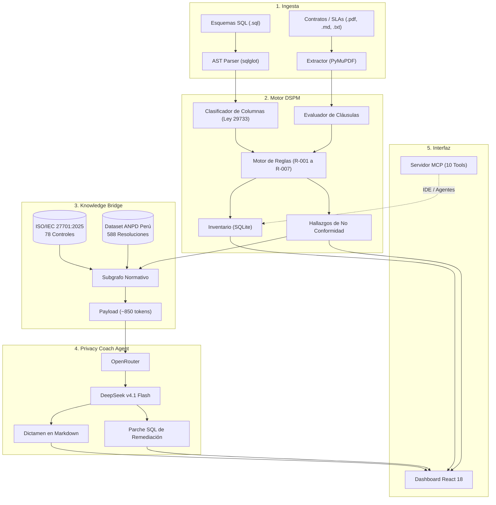

# Privacy-Coach-Agent-ISO-27701

> Motor DSPM y auditoría automatizada de privacidad. Alineado a ISO/IEC 27701:2025 y Ley Peruana N.º 29733 (ANPD).

[](https://www.python.org/)
[](https://fastapi.tiangolo.com/)
[](https://react.dev/)
[](https://openrouter.ai/)
[](https://modelcontextprotocol.io/)

---

## Qué hace

Audita bases de datos y contratos contra la normativa peruana de protección de datos personales. Detecta brechas de privacidad, calcula la exposición económica en UIT y genera scripts SQL de remediación.

**Componentes:**

| Componente | Función |
|---|---|
| Motor DSPM | Analiza esquemas SQL (DDL via `sqlglot`) y contratos/SLA (PDF/TXT via `PyMuPDF`). Detecta datos sensibles sin cifrar, hashes débiles, CVV almacenados, consentimiento tácito, retención indefinida, flujos transfronterizos sin registro y trabas ARCO. |
| Knowledge Bridge | Grafo dirigido (`networkx`) con 78 controles ISO/IEC 27701:2025, principios ISO/IEC 29100 y 588 precedentes sancionadores de la ANPD. Comprime +150k tokens de documentación regulatoria a ~850 tokens de contexto. |
| Privacy Coach Agent | Agente pericial (`deepseek/deepseek-v4.1-flash` via OpenRouter). Emite dictámenes técnicos con fundamentación legal, cálculo de multas y parches SQL listos para producción. |
| Servidor MCP | 10 herramientas expuestas via Model Context Protocol para integración con IDEs y agentes externos. |

---

## Arquitectura



---

## Estructura del Repositorio

```text
Privacy-Coach-Agent-ISO-27701/
├ .env.example              # Plantilla de variables de entorno
├ .gitignore
├ requirements.txt
├ README.md
│
├ docs/                     # Documentación técnica y académica (TIF UNSA)
│   ├ README.md              # Índice temático de los 9 documentos
│   └ ...
│
├ knowledge_base/           # Dominio normativo estructurado (ISO 27701 y Ley 29733)
│   ├ README.md              # Enlace a Google Drive (fuentes PDF) y matriz de trazabilidad
│   ├ datasets/              # Grafos y datasets JSON procesados
│   │   ├ iso27701_2025_graph.json
│   │   ├ anpd_sanciones_dataset.json
│   │   ├ iso29100_2024_principles.json
│   │   └ ley_29733_articulos.json
│   └ pipelines/             # Pipelines ETL de extracción y compilación
│       ├ build_datasets.py
│       └ parse_advanced_sanctions.py
│
└ src/                      # Código fuente de la aplicación
    ├ backend/
    │   ├ app.py             # API REST FastAPI
    │   ├ coach_agent.py     # Privacy Coach Agent (DeepSeek)
    │   ├ db.py              # Esquema SQLite
    │   ├ dspm_engine.py     # Motor de reglas deterministas
    │   ├ graph_engine.py    # Motor de consulta GraphRAG (NetworkX)
    │   ├ ingestion.py       # Parser DDL y contratos
    │   ├ knowledge_bridge.py# Puente semántico normativo
    │   ├ profiler.py        # Clasificador de columnas
    │   └ router.py          # Enrutador normativo
    ├ data/                  # Almacén SQLite local
    ├ frontend/
    │   ├ index.html         # Shell HTML y Tailwind
    │   ├ css/style.css      # Estilos y tema oscuro
    │   ├ js/app.jsx         # Dashboard interactivo React 18
    │   └ js/marked.min.js   # Parser Markdown local
    ├ mockups/               # Caso de prueba: Clínica SaludTotal
    ├ mcp_server.py          # Servidor Model Context Protocol (10 tools)
    └ run.py                 # Punto de entrada unificado
```

---

## Instalación

### Requisitos
- Python 3.10+
- API key de [OpenRouter](https://openrouter.ai/)

### Pasos

```bash
git clone https://github.com/TU_USUARIO/Privacy-Coach-Agent-ISO-27701.git
cd Privacy-Coach-Agent-ISO-27701

python -m venv .venv
# Windows:
.venv\Scripts\Activate.ps1
# Linux/macOS:
source .venv/bin/activate

pip install -r requirements.txt

cp .env.example .env
# Editar .env con tu API key de OpenRouter

python src/run.py
```

El servidor inicia en `http://127.0.0.1:8000`.

### Docker

```bash
docker build -t privacy-coach:local .
docker volume create privacy-coach-data
docker run --rm -p 8000:8000 \
  --env-file .env \
  -e DATABASE_PATH=/var/data/empresa_conocimiento.db \
  -v privacy-coach-data:/var/data \
  privacy-coach:local
```

Comprobar el contenedor:

```bash
curl --fail http://127.0.0.1:8000/api/status
```

---

## CI/CD y Render

El pipeline de `.github/workflows/ci.yml` ejecuta compilación, Ruff, Pytest, `pip-audit`, Bandit y el build de la imagen Docker. Las pruebas usan SQLite temporal y simulan el Coach, por lo que no consumen créditos de OpenRouter.

`render.yaml` define un Web Service Docker con un disco persistente en `/var/data`. Para configurarlo:

1. Crear un Blueprint en Render conectado a este repositorio.
2. Introducir `OPENROUTER_API_KEY` y una contraseña robusta en `APP_PASSWORD` cuando Render solicite las variables marcadas con `sync: false`.
3. Crear un Deploy Hook en **Settings > Deploy Hook** del servicio.
4. Guardar el hook en GitHub como secreto `RENDER_DEPLOY_HOOK_URL`.
5. Proteger el environment de GitHub `production` si se requiere aprobación manual.

Cada push a `main` despliega únicamente después de completar CI. `autoDeploy` queda desactivado en Render para evitar despliegues paralelos fuera del pipeline.

En producción, toda la interfaz y API usan HTTP Basic con `APP_USERNAME` y `APP_PASSWORD`. Solo `/api/status` permanece público para el health check de Render.

> El disco persistente requiere un plan de Render compatible. Sin disco, SQLite se pierde en cada despliegue. Para escalado horizontal debe reemplazarse SQLite por PostgreSQL.

Comandos de verificación local equivalentes a CI:

```bash
pip install -r requirements-dev.txt
python -m compileall -q src knowledge_base tests
ruff check src knowledge_base tests
pytest
pip-audit -r requirements.txt
bandit -q -r src -x tests
docker build -t privacy-coach:ci .
```

---

## Servidor MCP

`src/mcp_server.py` expone 10 herramientas via Model Context Protocol:

| Herramienta | Descripción |
|---|---|
| `dspm_get_status` | Estado de la base de datos y conteo de activos. |
| `dspm_audit_repository` | Auditoría completa sobre esquemas y contratos cargados. |
| `dspm_classify_column` | Clasifica un campo SQL bajo categorías de la Ley 29733. |
| `graphrag_query_normative` | Consulta el subgrafo ISO 27701 / ISO 29100 / Ley 29733. |
| `anpd_search_sanctions` | Busca en 588 resoluciones sancionadoras de la ANPD. |
| `coach_consult` | Dictamen técnico con parche SQL via DeepSeek Flash. |
| `dspm_apply_remediation` | Aplica parches SQL o marca hallazgos como subsanados. |
| `dspm_load_demo_case` | Carga el caso de prueba de Clínica SaludTotal. |
| `dspm_reset_repository` | Reinicia el repositorio a estado cero. |
| `dspm_ingest_file` | Carga nuevos esquemas SQL o contratos. |

### Configuración MCP

```json
{
  "mcpServers": {
    "privacy-dspm": {
      "command": "python",
      "args": ["-X", "utf8", "C:/ruta/a/Privacy-Coach-Agent-ISO-27701/src/mcp_server.py"]
    }
  }
}
```

---

## Créditos

- **Universidad Nacional de San Agustín de Arequipa (UNSA)**
- Escuela Profesional de Ingeniería de Sistemas
- Auditoría de Sistemas — Trabajo de Investigación Formativa (TIF), Semestre 2026-B

## Licencia

MIT. Ver archivo `LICENSE`.
